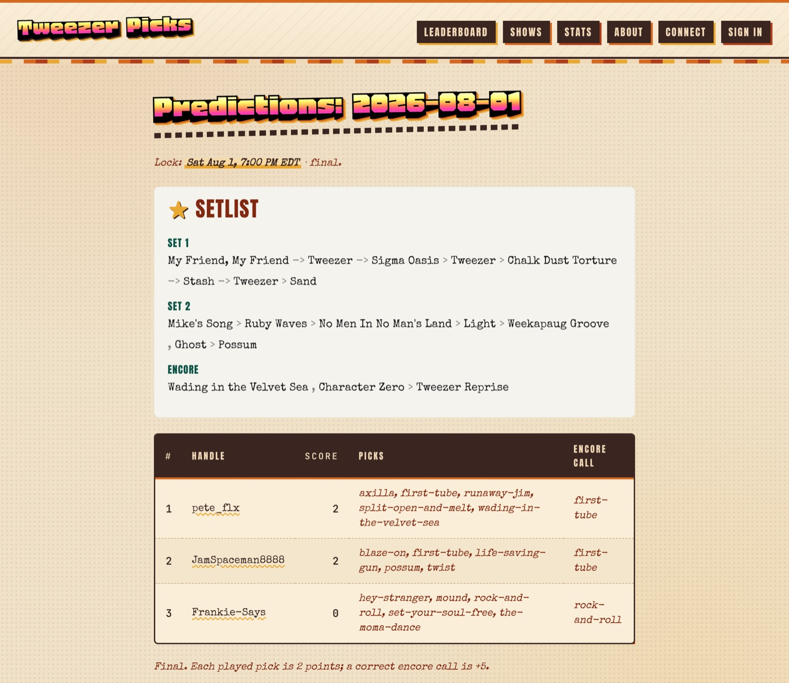
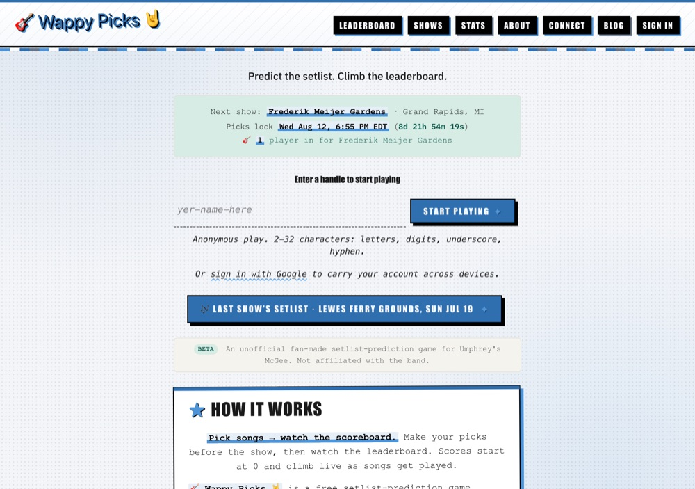

# open-setlist-stash

[](https://github.com/pete-builds/open-setlist-stash/actions/workflows/ci.yml)
[](https://github.com/pete-builds/open-setlist-stash/pkgs/container/open-setlist-stash)
[](./LICENSE)

**A self-hostable prediction game that reads any band's setlist data over MCP.**

The game engine holds no setlist data of its own. Every read goes out over the
[Model Context Protocol](https://modelcontextprotocol.io) to a server you point it at, so the
same container runs for Phish, Umphrey's McGee, or any act you can stand up a data source for.
Bring an MCP server that satisfies the setlist contract and you have a working game.



<sub>A resolved show. The setlist and the standings are rendered from the same scoring tick, so
they can never disagree on screen.</sub>

## Two bands, one image, zero forks

| Deployment | Band | Data source | Differences from stock |
|---|---|---|---|
| [tweezerpicks.com](https://tweezerpicks.com) | Phish | [mcp-phish](https://github.com/pete-builds/mcp-phish) | env + mounted CSS |
| [wappypicks.com](https://www.wappypicks.com) | Umphrey's McGee | [mcp-umphreys](https://github.com/pete-builds/mcp-umphreys) | env + mounted CSS |

Both run the same published image. They differ only by environment config, branding, and
which MCP server they read. There is no per-band fork and no band-specific code path.



## Bring your own data (MCP)

The game never touches a setlist database directly. It speaks JSON-RPC over Streamable HTTP to
the MCP server named by `MCP_PHISH_URL` (the env name is historical, point it anywhere). The
async wrapper in [`src/setlist_stash/mcp_client.py`](src/setlist_stash/mcp_client.py) calls the
tools that server exposes:

| Tool | Used for |
|---|---|
| `get_show(date)` | the live and resolved setlist, the scoring input |
| `recent_shows()` | picking the next show to open predictions on |
| `search_songs(q)` | the pre-lock song picker (returns slug + title + show gap only) |
| `validate_song_slugs([...])` | server-side gate on every submitted pick |
| `get_song(slug)` | display titles and gap detail |
| `stats_overview()` | the optional `/stats` page |

To support a new band, stand up an MCP server that satisfies that contract and change one env
var. Reference implementations: [mcp-phish](https://github.com/pete-builds/mcp-phish) (phish.net
/ phish.in) and [mcp-umphreys](https://github.com/pete-builds/mcp-umphreys)
([All Things Umphreys](https://allthings.umphreys.com), backed by
[umphreys-vault](https://github.com/pete-builds/umphreys-vault)).

A deployment can also **re-expose its upstream MCP publicly** at `/mcp` (set `MCP_UPSTREAM_URL`),
rate limited per IP, so fans can wire the band's setlist data into their own MCP client. The
`/connect` page renders the copy/paste setup for it.

## The game

Pick **up to 5 songs** for an upcoming show (at least one required). Each song that gets played
is worth **2 points**. You also make **one encore call**: tap one of your picks as your encore
guess. If it lands in the encore you get **+5**; if it plays elsewhere it still earns its 2.

Predictions **lock** at a configurable showtime. The game then **scores live during the show**,
re-reading the partial setlist and rebuilding the leaderboard on a short interval, so scores
climb in real time as songs get played. Leaderboards run per-league and global.

The song picker shows each song's **show gap** (how many shows since it was last played) so you
do not burn a pick on something played last night. It is a fair human contest: any optional
smart-pick assist is disabled during the prediction window.

Scoring a live setlist is the interesting part. A setlist typed in during the show grows set by
set with the encore entered last, so scoring the first non-empty read would freeze everyone's
encore pick against the end of Set 1. The resolver only finalizes a show once an encore is
detected **and** the track count has held steady for a configurable quiet window, with a time
backstop. See [`completeness.py`](src/setlist_stash/completeness.py).

## Run it

```bash
cp .env.example .env
# edit .env: set PG_PASSWORD, SESSION_SECRET, and MCP_PHISH_URL (your MCP data server)
docker compose up -d
curl http://localhost:3706/healthz
```

Or pull the published image instead of building:

```bash
docker pull ghcr.io/pete-builds/open-setlist-stash:latest
```

`SESSION_SECRET` is not optional on a production deployment. The app **refuses to boot** if
`COOKIE_SECURE=true` or `BASE_URL` is https while the session secret is still the shipped
development default, so nobody accidentally signs cookies with a publicly known key.

## Branding your instance

All branding is deployment-specific (config plus mounted assets), so the public repo carries no
operator-specific identity.

- **Name:** every page title and the brand wordmark read from `SITE_NAME`. Emoji work (e.g. `SITE_NAME="🎸 Wappy Picks 🤘"`).
- **Footer credit:** set `FOOTER_CREDIT` and `FOOTER_CREDIT_URL` to add an attribution line (defaults empty, so a self-host shows none).
- **Theme:** the platform ships a clean default (`static/style.css`). Layer your own CSS on top via either:
  - *Bundle it (good for forks):* drop a file in `src/setlist_stash/static/themes/your-theme.css`, set `THEME_FILE=themes/your-theme.css`, rebuild.
  - *Keep it private (good if the branding is yours):* mount the CSS at runtime via `docker-compose.override.yml` (see `docker-compose.override.yml.example`). The CSS lives outside the repo on the host; compose merges the override on `up`.
- **Email signup** is gated on `EMAIL_PROVIDER`: with it `disabled` (the default), the magic-link UI is hidden and players join with an anonymous handle plus cookie. Set a real provider to enable email magic-link auth.
- **Google sign-in (SSO)** is gated on `GOOGLE_CLIENT_ID` + `GOOGLE_CLIENT_SECRET`: with both blank (the default) no Google buttons render and the `/auth/google/*` routes redirect home. Provision a Google OAuth "Web application" client, set the two env vars, point `BASE_URL` at your public origin (the redirect URI is `{BASE_URL}/auth/google/callback`), and set `COOKIE_SECURE=true` on HTTPS. Signing in with Google while already holding a handle cookie links Google to that same account, so existing players keep their handle, picks, and games. See `.env.example` for the full setup notes.
- **Private leagues** are gated on `ENABLE_GAMES` and per-show **comment threads** on `ENABLE_COMMENTS`. Both default on; setting either false hides the UI and 404s the routes without deleting a table.

### Blog (optional)

Drop markdown files (optional `title`/`date`/`summary` frontmatter) into the directory named by
`BLOG_DIR` (default `content/blog`, typically a mounted volume so posts stay deployment-specific).
Posts render at `/blog` and `/blog/{slug}`; the nav "Blog" link only appears when at least one
post is present.

## Stack

- Python 3.13, FastAPI, Jinja2, HTMX (server-rendered, no build step, no SPA)
- PostgreSQL for game state only. Setlist data is never stored, it is read over MCP.
- Docker multi-stage build, non-root, hash-pinned lockfiles
- CI: ruff, mypy `--strict`, pytest against a real Postgres, Trivy scan of the built image
- Deployable LAN-only, over Tailscale, or publicly (e.g. behind a Cloudflare Tunnel)

Security posture is documented in [SECURITY.md](./SECURITY.md). Design notes for the original
build are in [docs/PHASE-4-PLAN.md](./docs/PHASE-4-PLAN.md).

## License

MIT, see [LICENSE](./LICENSE).

## Attribution

This project consumes setlist data through MCP servers. The Phish deployment uses data from
[phish.net](https://phish.net) and [phish.in](https://phish.in) via mcp-phish; the Umphrey's
deployment uses [All Things Umphreys](https://allthings.umphreys.com) via mcp-umphreys. Not
affiliated with those data sources or with the artists.
